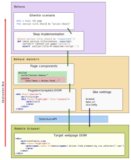

Manners Overview
=================

`behave_manners` is designed to be a weapon against complexity of modern
web sites (rather, applications). Offers utility methods and a powerful
abstraction layer on top of `Web Elements`, the standard objects of
[WebDriver] API.

'manners' offers tools in these areas:

#. setting up the 'site' and calling the client browser
#. navigating through the site, by URLs and matching 'known pages'
#. decoding the remote DOM into an abstract structure of `components`
#. consistent error handling, logs and screenshots as a separate layer

Also, some early work is done in enriching the `Gherkin` language with
more structure, re-usable scenarios and resources.

