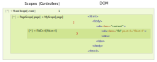

.. _scopes-controllers:

Scopes and Controllers
=======================

Scopes and Controllers are a way to inject extra behaviour onto components, from
code written in Python. They are able to abstract non-trivial interactions as if
they were instance methods to the component objects.

Scopes have their own tree (hierarchy) are deliberately *not* 1:1 with components.
Reason is to keep code minimal, not to mandate extra code per each component.
In practice, few of the components, only, will ever need their own controller.

.. note:: *scopes* and *controllers* are used as terms interchangeably, they 
    are the same thing. A `controller` is the class that defines custom behaviour,
    a `scope` is the instantiated object of that class, that could also have state.

Service Metaclass
------------------

Controller classes are using the `Service Meta` class, derive from :py:class:`DOMScope` .
This means that they can be referenced by ``_name``, and can be overriden by defining
the same name in some custom python module.

Inheritance
------------

Apart from python (or rather service-meta) inheritance, scopes also hold a reference
of their parent in the Component Tree. By default, they *inherit* the attributes of
that parent scope. This allows nested components to call parent scope's methods, or
even to modify that parent's state.

